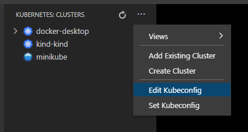
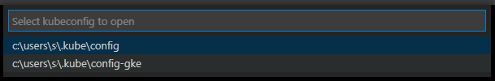
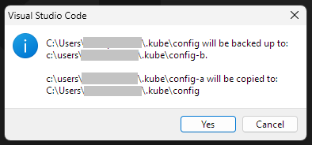

# vscode-kubernetes-edit-kubeconfig

- Edit kubeconfig files
- Swap kubeconfig files

# How to use?

The command Edit kubeconfig can be invoked from the Kubernetes:Clusters view title context menu.

- Edit Kubeconfig command

  
  - Select Kubeconfig to open for editing

  

- Swap Kubeconfig command
  - Prompts to select Kubeconfig to swap in from. (`~/.kube/config` is excluded from prompt)
  - Prompts to select Kubeconfig (`~/.kube/config` is excluded from prompt) to backup `~/.kube/config` to.
    - There is an option to create a new backup file name.
  - Shows a confirmation dialog.

	
  - After confirmation performs the backup followed by swap in. Useful to switch between clusters with dedicated config fils e.g. config-eks, config-gke, config-aks etc, and still using the default config file `~/.kube/config`.