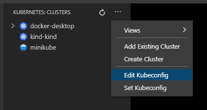
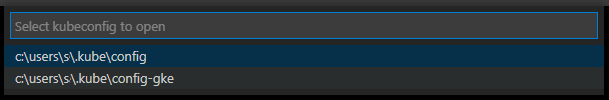

# vscode-kubernetes-edit-kubeconfig

Edit kubeconfig files

# How to use?

The command Edit kubeconfig can be invoked from the Kubernetes:Clusters view title context menu.

- Edit Kubeconfig

- Select Kubeconfig

